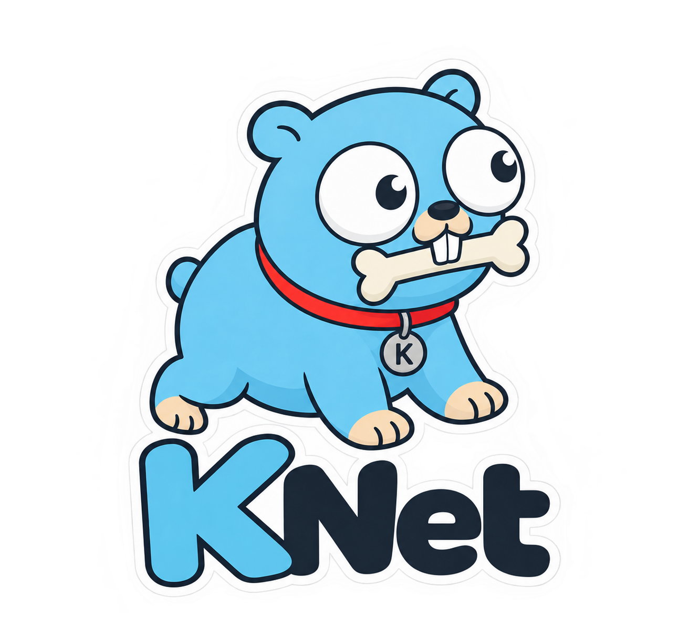
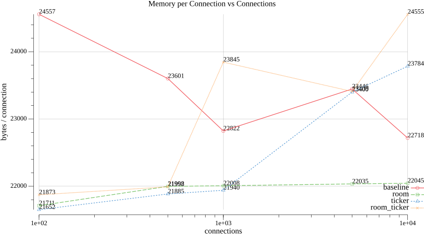
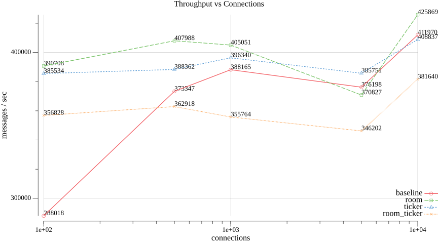
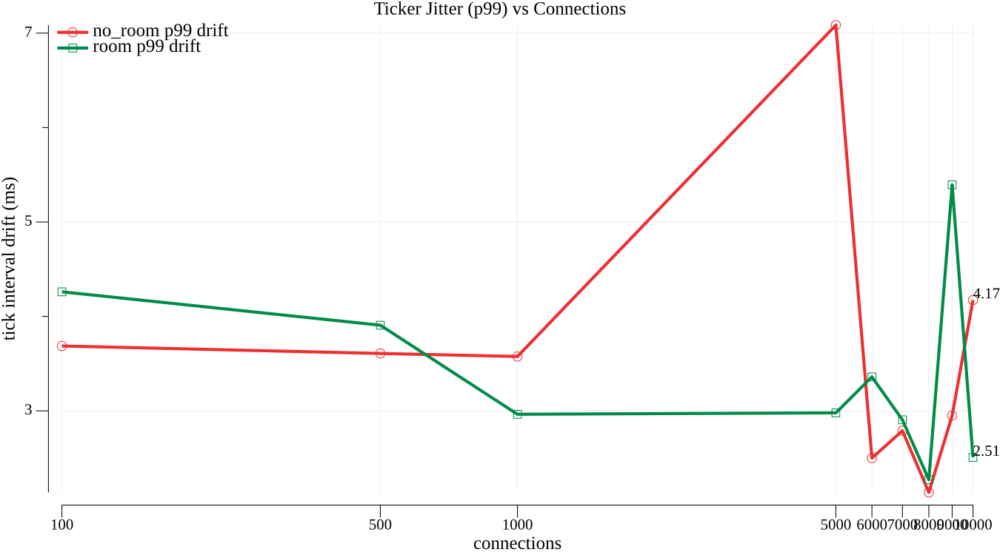

<p align="center">
  
</p>

<h1 align="center">knet</h1>
<p align="center"><strong>Real-time infra without the WebSocket wrestling match.</strong></p>

[](https://pkg.go.dev/github.com/luciancaetano/knet)
[](https://goreportcard.com/report/github.com/luciancaetano/knet)

Go library for building game servers and real-time apps over WebSocket. Binary command-pattern protocol with optional JSON-RPC 2.0 support.

## Features

- Binary command protocol: 4-byte command ID (uint32 BE) + payload, zero-copy decode
- Optional JSON-RPC 2.0 for request/response workflows
- Per-client rate limiting, `OnConnect`/`OnDisconnect` callbacks, broadcasting
- Built-in timeouts, payload limits, origin validation
- Opt-in packages: `room` (client groups), `observer` (interest-managed broadcast), `syncvar` (dirty-tracked state sync), `timing` (tick scheduler + RTT ping)

## Performance Benchmarks

Automated suite (`.benchmark/`) measuring latency, memory/connection, throughput and Ticker jitter across 100–10,000 connections, with and without `RoomManager`/`Ticker`. See [`.benchmark/README.md`](.benchmark/README.md) for how to run it and why 10,000 is the max load tested on a single machine.

**Latency (p99)** — round-trip echo time vs connections, one line per scenario


**Memory / connection** — heap bytes per client, isolating Room/Ticker overhead



**Throughput** — server-measured messages/sec vs connections



**Ticker jitter** — p99 drift of tick fire time vs configured interval, with/without Room broadcast



## Install

```bash
go get github.com/luciancaetano/knet
```

## Quick Start

```go
package main

import (
	"context"
	"log"

	"github.com/luciancaetano/knet"
	"github.com/luciancaetano/knet/ws"
)

func main() {
	ctx := context.Background()

	config := ws.NewConfig(
		":8080",
		ws.DefaultRateLimitConfig(), // 100 msg/s, burst 200
		ws.AllOrigins(),             // use a custom check in production
		func(client knet.Client) { client.Send(ctx, 0x0001, []byte("welcome")) },
		func(client knet.Client) { log.Printf("disconnected: %s", client.ID()) },
	)

	server := ws.New(config)
	server.RegisterHandler(ctx, 0x0100, func(client knet.Client, payload []byte) {
		client.Send(ctx, 0x0100, []byte("login ok"))
	})

	log.Fatal(server.Start(ctx))
}
```

## Protocol

`CommandID` (4 bytes, uint32 BE) + payload. `CommandID 0x01` + `"hello"` → `[0x00,0x00,0x00,0x01,'h','e','l','l','o']`.

Split your ID space by feature, e.g. `0x0100-0x01FF` player actions, `0x0200-0x02FF` chat.

**Reserved IDs** — do not register handlers on these:

| ID | Purpose |
|----|---------|
| `0xFFFFFFFF` | JSON-RPC request/response |
| `0xFFFFFFFE` | JSON-RPC error response |
| `0xFFFFFFFD` | Ping/pong RTT (`timing.TimeManager.EnablePing`) |

## Configuration

`ws.NewConfig(addr, rateLimit, checkOrigin, onConnect, onDisconnect)`:

| Param | Type | Notes |
|-------|------|-------|
| `addr` | `string` | listen address, e.g. `":8080"` |
| `rateLimit` | `*ws.RateLimitConfig` | `ws.DefaultRateLimitConfig()`, `ws.NoRateLimit()`, or custom `&ws.RateLimitConfig{MessagesPerSecond, Burst, Enabled}` |
| `checkOrigin` | `ws.CheckOriginFn` | `ws.AllOrigins()` or `func(*http.Request) bool` |
| `onConnect`/`onDisconnect` | callback | optional, `nil` allowed |

> [!WARNING]
> Never use `ws.AllOrigins()` in production.

```go
checkOrigin := func(r *http.Request) bool {
	allowed := map[string]bool{"https://yourdomain.com": true}
	return allowed[r.Header.Get("Origin")]
}
config := ws.NewConfig(":8080", ws.DefaultRateLimitConfig(), checkOrigin, nil, nil)
```

Optional post-config setup: `ws.WithLogger(cfg, logger)`, `ws.WithMetrics(cfg, metrics)`, `ws.WithTLS(cfg, certFile, keyFile)`.

## Message Handlers

**Command pattern** — async, fire-and-forget, own goroutine per message. Game events, chat, notifications:

```go
server.RegisterHandler(ctx, 0x0100, func(client knet.Client, payload []byte) {
	position := processMovement(payload)
	client.Send(ctx, 0x0100, position)
	server.BroadcastCommand(ctx, 0x0101, position)
})
```

**JSON-RPC pattern** — synchronous request/response, [JSON-RPC 2.0 spec](https://www.jsonrpc.org/specification). Queries, config, auth:

```go
server.RegisterJSONRPCHandler(ctx, "player.getStats", func(params map[string]interface{}) (interface{}, error) {
	playerID, ok := params["playerId"].(string)
	if !ok {
		return nil, fmt.Errorf("invalid playerId")
	}
	return getPlayerStats(playerID), nil
})
```

> [!NOTE]
> Payload slices are zero-copy — don't retain/modify past the handler call. Handlers run concurrently; don't assume order. Register all handlers before `Start()`.

## Security & Limits

| Feature | Default | Notes |
|---------|---------|-------|
| Max payload | 10MB | prevents OOM |
| Read timeout | 60s | renewed per message |
| Write timeout | 10s | prevents slow clients from blocking |
| Ping interval | 54s | keepalive, auto pong detection |
| Rate limit | 100 msg/s, burst 200 | per-client, token bucket |
| Origin check | none (must configure) | `ws.CheckOriginFn` |

A client over the rate limit is closed with code `1008` (Policy Violation).

## Rooms

`room` package (opt-in) groups clients into named sets for scoped broadcasting — matches, lobbies, zones, chat channels.

```go
import "github.com/luciancaetano/knet/room"

lobby := room.New("lobby-1")

config := ws.NewConfig(":8080", ws.DefaultRateLimitConfig(), ws.AllOrigins(),
	func(client knet.Client) { lobby.Add(client) },
	func(client knet.Client) { lobby.Remove(client.ID()) },
)
server := ws.New(config)

server.RegisterHandler(ctx, ChatCmd, func(client knet.Client, payload []byte) {
	lobby.BroadcastExcept(ctx, client.ID(), ChatCmd, payload)
})
```

| Method | Description |
|--------|-------------|
| `Add(client)` | insert a client (idempotent on reconnect) |
| `Remove(clientID)` | evict a client, no-op if absent |
| `Has(clientID)` | check membership |
| `Clients()` | snapshot of all clients in the room |
| `Broadcast(ctx, commandID, payload)` | send to everyone in the room |
| `BroadcastExcept(ctx, excludeID, commandID, payload)` | send to everyone but one client |
| `Close(ctx)` | remove and disconnect all clients |

A client can belong to multiple rooms at once.

See [pkg.go.dev](https://pkg.go.dev/github.com/luciancaetano/knet) for full API docs and the `observer`/`syncvar`/`timing` packages. Examples in [`examples/`](examples).

## License

MIT — see [LICENSE](LICENSE).
