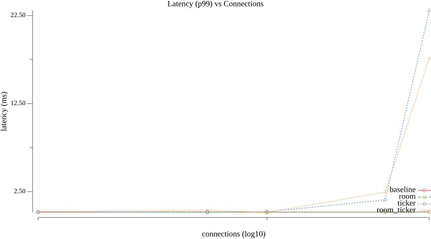

# Introduction

## What is knet?

**knet** is a Go library for building game servers and real-time applications over WebSocket. Instead of reinventing binary communication, connection management, and broadcasting every time you start a multiplayer project, knet delivers that out of the box — and stays out of your way for the rest.

At its core, the idea is simple: messages travel as `4 bytes of command ID + binary payload`. No JSON parsing on the hot path, no reflection, no layers on top of layers. You register a handler for a command, knet decodes it zero-copy and delivers it to your code. When you need request/response (login, queries, config), JSON-RPC 2.0 is available as an option — not a requirement.

## Why this library exists

Building the networking layer of a multiplayer game from scratch means solving, over and over, the same problems: how to send data efficiently, how to group players into rooms, how to sync state without wasting bandwidth, how to keep a stable tick rate, how to keep a malicious client from bringing the server down. These are infrastructure problems, not gameplay problems — and getting any of them wrong costs dearly later, in production bugs at 3am.

knet was created to isolate exactly this layer:

- **Binary protocol** with command pattern, so you spend bytes only on what matters
- **`room`** for grouping clients (lobbies, matches, zones, chat channels)
- **`observer`** for interest management — each client only receives updates for what it actually cares about
- **`syncvar`** for replicating state only when it changes, avoiding broadcast of duplicate data
- **`timing`** for running a game loop at a fixed tick rate, decoupled from your simulation's frequency

Each of these pieces is optional. You can use just the base server and nothing else.

## Performance and scalability

knet is built on two deliberate decisions:

**Binary protocol, zero-copy decoding.** The payload that arrives in your handler is the same memory slice received from the socket — no allocating a copy, no JSON serialize/deserialize on the server's hottest path (game message processing, which runs hundreds or thousands of times per second per connected client).

**Go's native concurrency.** Each handler runs on its own goroutine — Go's concurrency model handles tens of thousands of simultaneous connections without the overhead of OS threads. Per-client rate limiting (token bucket), read/write timeouts, and payload size limits (10 MB by default) protect the server against slow clients, unbounded queueing, and trivial giant-payload attacks — without you having to write any of it.

In practice, this means: a single Go process, running on a modest machine, can handle a concurrent client load that would require an entire fleet in languages with heavier runtimes or OS-thread-based concurrency models.

## Low cost

Go compiles to a single static binary, with no VM and no heavy runtime to load. That translates directly into infrastructure cost:

- **Fewer machines for the same load** — Go's goroutine model processes far more concurrent connections per CPU core than most OS-thread-based alternatives
- **Less memory per connection** — a goroutine costs a few KB of initial stack, not MBs of thread
- **Simple, cheap deployment** — a static binary with no runtime dependencies, runs anywhere
- **No license fee or proprietary runtime** — Go and knet are open source, MIT license

The practical result: you pay for real CPU and memory, not for platform overhead. For a multiplayer game that needs to scale from a handful of players to thousands without rewriting the network stack, that's the kind of savings that adds up month over month.

## Who knet is for

If you're building anything that needs:

- Shared state between multiple clients in real time (multiplayer games, collaborative rooms, live dashboards)
- An efficient protocol that doesn't waste bandwidth on text overhead
- A foundation that scales without requiring an architecture rewrite as user count grows

... knet was made for you. It doesn't try to be a game engine, nor does it impose ECS architecture or fixed ticks by default — it's the network layer, and only that, built to be fast, predictable, and cheap to operate.

## Benchmarks

knet ships an automated benchmark suite (`.benchmark/` in the repo) measuring latency, memory per connection, throughput, and Ticker jitter across 100 to 10,000 concurrent connections — with and without `RoomManager` and `Ticker` enabled. (10,000 is the practical ceiling for a single-machine, single-loopback-IP test: each client connection needs its own ephemeral source port, and the OS's local port range runs out well before 50,000 — see the suite's README for details.)

**Latency (p99)** — round-trip echo time vs connections, one line per scenario (baseline / room / ticker / room+ticker)

**Memory / connection** — heap bytes per client, isolating the fixed cost `room`/`timing` add on top of a bare connection

**Throughput** — messages/sec the server sustains, measured server-side via the `knet_msg_received_total` metric

**Ticker jitter** — p99 drift between a tick's actual fire time and its configured interval, comparing plain `Register` against `RegisterRoom` (which also broadcasts)

See the [benchmark suite README](https://github.com/luciancaetano/knet/tree/main/.benchmark) for how to reproduce these numbers.

## Next step

Ready to see the code? Head to [Getting Started](getting-started.md) and spin up your first server in a few minutes.
